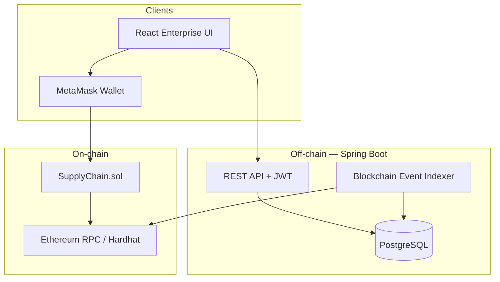

# Component Diagram

```mermaid
flowchart TB
  subgraph clients [Clients]
    WEB[React Enterprise UI]
    MM[MetaMask Wallet]
  end
  subgraph offchain [Off-chain — Spring Boot]
    API[REST API + JWT]
    IDX[Blockchain Event Indexer]
    PG[(PostgreSQL)]
  end
  subgraph onchain [On-chain]
    SC[SupplyChain.sol]
    RPC[Ethereum RPC / Hardhat]
  end
  WEB --> API
  WEB --> MM
  MM --> SC
  API --> PG
  IDX --> RPC
  IDX --> PG
  SC --> RPC
```
