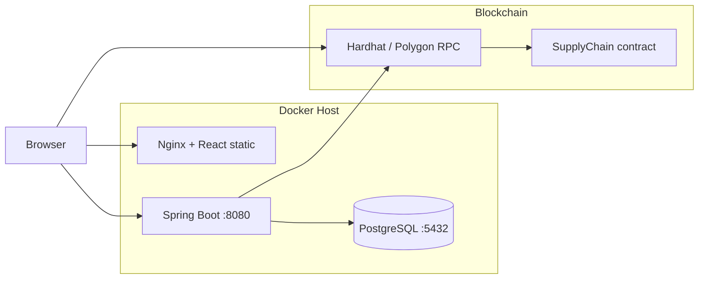

# Deployment Diagram

```mermaid
flowchart LR
  subgraph host [Docker Host]
    FE[Nginx + React static]
    BE[Spring Boot :8080]
    DB[(PostgreSQL :5432)]
  end
  subgraph chain [Blockchain]
    HH[Hardhat / Polygon RPC]
    SC[SupplyChain contract]
  end
  Browser --> FE
  Browser --> BE
  Browser --> HH
  BE --> DB
  BE --> HH
  HH --> SC
```
