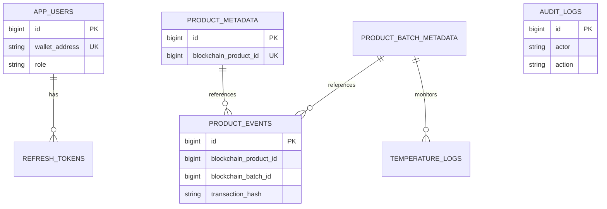

# ER Diagram

```mermaid
erDiagram
  APP_USERS ||--o{ REFRESH_TOKENS : has
  PRODUCT_METADATA ||--o{ PRODUCT_EVENTS : references
  PRODUCT_BATCH_METADATA ||--o{ PRODUCT_EVENTS : references
  PRODUCT_BATCH_METADATA ||--o{ TEMPERATURE_LOGS : monitors
  APP_USERS {
    bigint id PK
    string wallet_address UK
    string role
  }
  PRODUCT_METADATA {
    bigint id PK
    bigint blockchain_product_id UK
  }
  PRODUCT_EVENTS {
    bigint id PK
    bigint blockchain_product_id
    bigint blockchain_batch_id
    string transaction_hash
  }
  AUDIT_LOGS {
    bigint id PK
    string actor
    string action
  }
```
