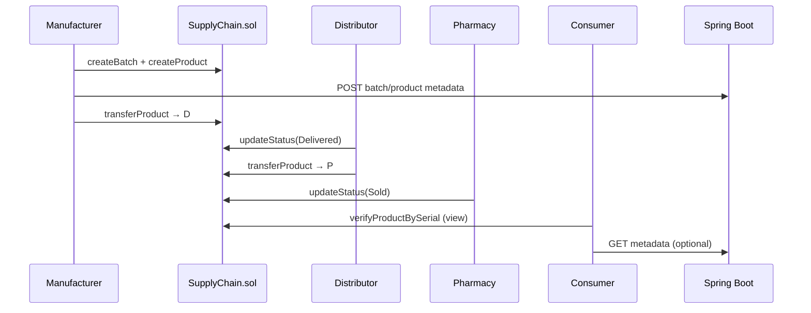

# Sequence — Product Lifecycle

```mermaid
sequenceDiagram
  participant M as Manufacturer
  participant SC as SupplyChain.sol
  participant D as Distributor
  participant P as Pharmacy
  participant C as Consumer
  participant API as Spring Boot

  M->>SC: createBatch + createProduct
  M->>API: POST batch/product metadata
  M->>SC: transferProduct → D
  D->>SC: updateStatus(Delivered)
  D->>SC: transferProduct → P
  P->>SC: updateStatus(Sold)
  C->>SC: verifyProductBySerial (view)
  C->>API: GET metadata (optional)
```
