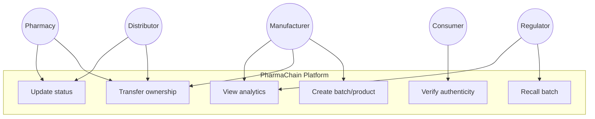

# Use Case Diagram

```mermaid
flowchart TB
  M((Manufacturer))
  D((Distributor))
  P((Pharmacy))
  R((Regulator))
  C((Consumer))

  subgraph system [PharmaChain Platform]
    UC1[Create batch/product]
    UC2[Transfer ownership]
    UC3[Update status]
    UC4[Recall batch]
    UC5[Verify authenticity]
    UC6[View analytics]
  end

  M --> UC1
  M --> UC2
  D --> UC2
  D --> UC3
  P --> UC2
  P --> UC3
  R --> UC4
  R --> UC6
  C --> UC5
  M --> UC6
```
