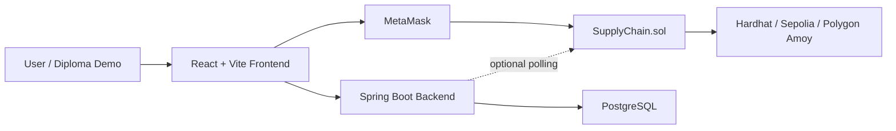
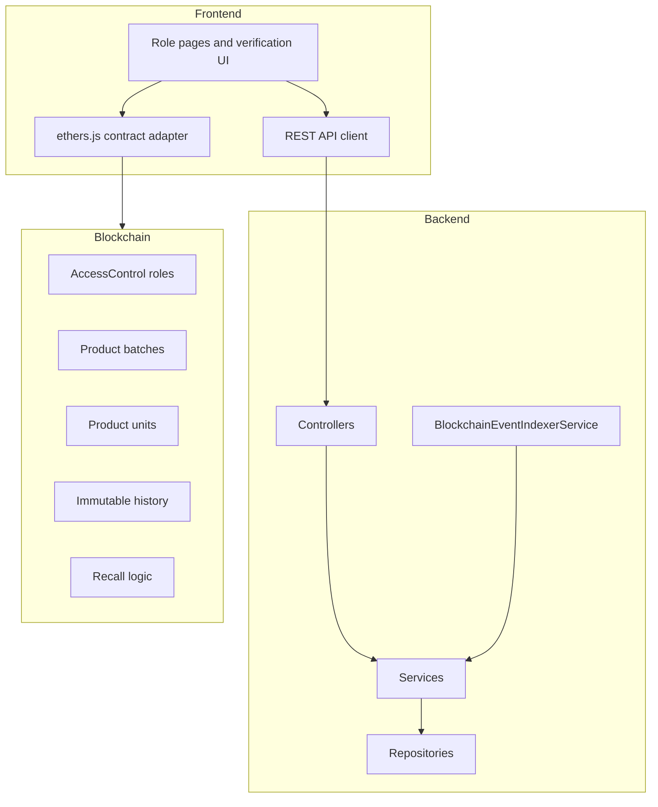
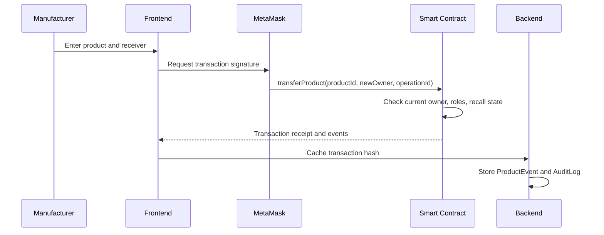
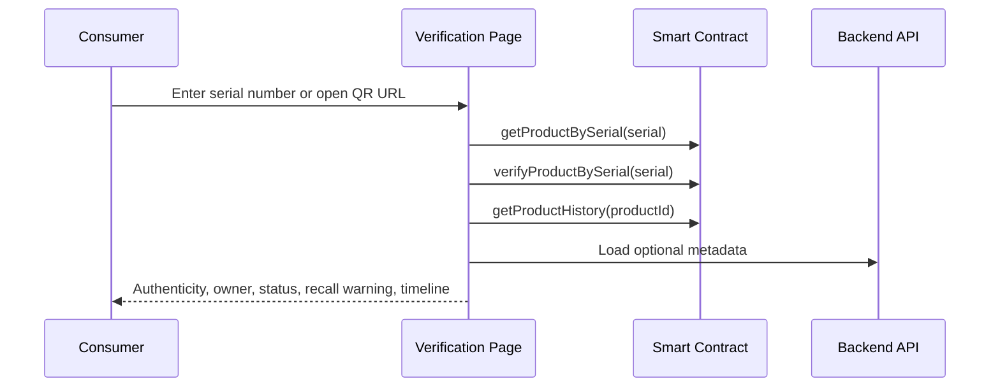
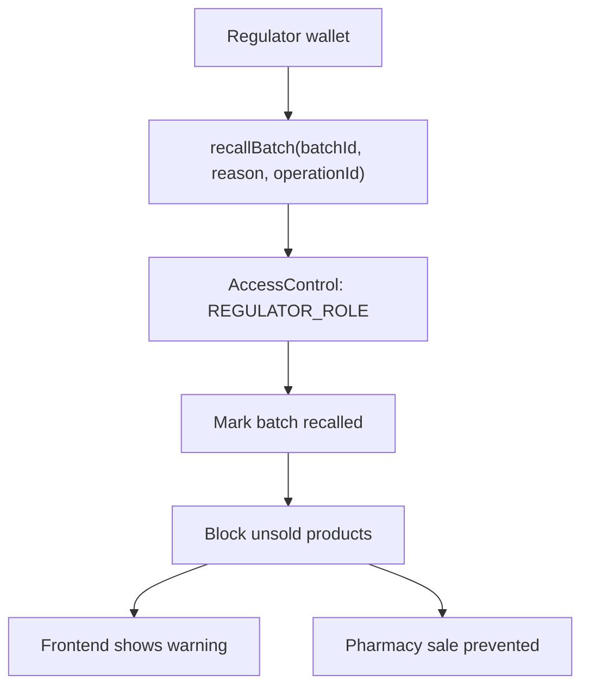
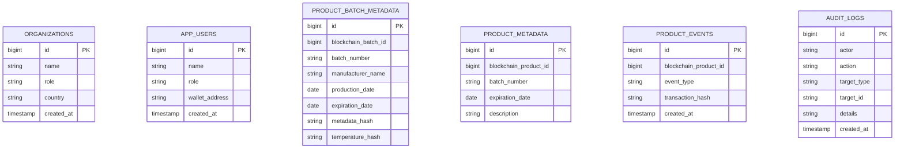

# Mermaid Diagrams

## System Architecture

```mermaid
flowchart LR
    User["User / Diploma Demo"] --> Frontend["React + Vite Frontend"]
    Frontend --> MetaMask["MetaMask"]
    MetaMask --> Contract["SupplyChain.sol"]
    Frontend --> Backend["Spring Boot Backend"]
    Backend --> Postgres["PostgreSQL"]
    Backend -. optional polling .-> Contract
    Contract --> Testnet["Hardhat / Sepolia / Polygon Amoy"]
```

## Component Diagram

```mermaid
flowchart TB
    subgraph Frontend
        Pages["Role pages and verification UI"]
        Ethers["ethers.js contract adapter"]
        ApiClient["REST API client"]
    end

    subgraph Backend
        Controllers["Controllers"]
        Services["Services"]
        Repositories["Repositories"]
        Indexer["BlockchainEventIndexerService"]
    end

    subgraph Blockchain
        Access["AccessControl roles"]
        Batch["Product batches"]
        Product["Product units"]
        History["Immutable history"]
        Recall["Recall logic"]
    end

    Pages --> Ethers --> Blockchain
    Pages --> ApiClient --> Controllers --> Services --> Repositories
    Indexer --> Services
```

## Product Transfer Sequence

```mermaid
sequenceDiagram
    participant M as Manufacturer
    participant F as Frontend
    participant W as MetaMask
    participant C as Smart Contract
    participant B as Backend

    M->>F: Enter product and receiver
    F->>W: Request transaction signature
    W->>C: transferProduct(productId, newOwner, operationId)
    C->>C: Check current owner, roles, recall state
    C-->>F: Transaction receipt and events
    F->>B: Cache transaction hash
    B->>B: Store ProductEvent and AuditLog
```

## Verification Flow

```mermaid
sequenceDiagram
    participant Consumer
    participant UI as Verification Page
    participant Chain as Smart Contract
    participant API as Backend API

    Consumer->>UI: Enter serial number or open QR URL
    UI->>Chain: getProductBySerial(serial)
    UI->>Chain: verifyProductBySerial(serial)
    UI->>Chain: getProductHistory(productId)
    UI->>API: Load optional metadata
    UI-->>Consumer: Authenticity, owner, status, recall warning, timeline
```

## Recall Flow

```mermaid
flowchart TD
    Regulator["Regulator wallet"] --> Recall["recallBatch(batchId, reason, operationId)"]
    Recall --> Check["AccessControl: REGULATOR_ROLE"]
    Check --> Batch["Mark batch recalled"]
    Batch --> Products["Block unsold products"]
    Products --> UI["Frontend shows warning"]
    Products --> Sale["Pharmacy sale prevented"]
```

## Database Schema

```mermaid
erDiagram
    ORGANIZATIONS {
        bigint id PK
        string name
        string role
        string country
        timestamp created_at
    }
    APP_USERS {
        bigint id PK
        string name
        string role
        string wallet_address
        timestamp created_at
    }
    PRODUCT_BATCH_METADATA {
        bigint id PK
        bigint blockchain_batch_id
        string batch_number
        string manufacturer_name
        date production_date
        date expiration_date
        string metadata_hash
        string temperature_hash
    }
    PRODUCT_METADATA {
        bigint id PK
        bigint blockchain_product_id
        string batch_number
        date expiration_date
        string description
    }
    PRODUCT_EVENTS {
        bigint id PK
        bigint blockchain_product_id
        string event_type
        string transaction_hash
        timestamp created_at
    }
    AUDIT_LOGS {
        bigint id PK
        string actor
        string action
        string target_type
        string target_id
        string details
        timestamp created_at
    }
```
